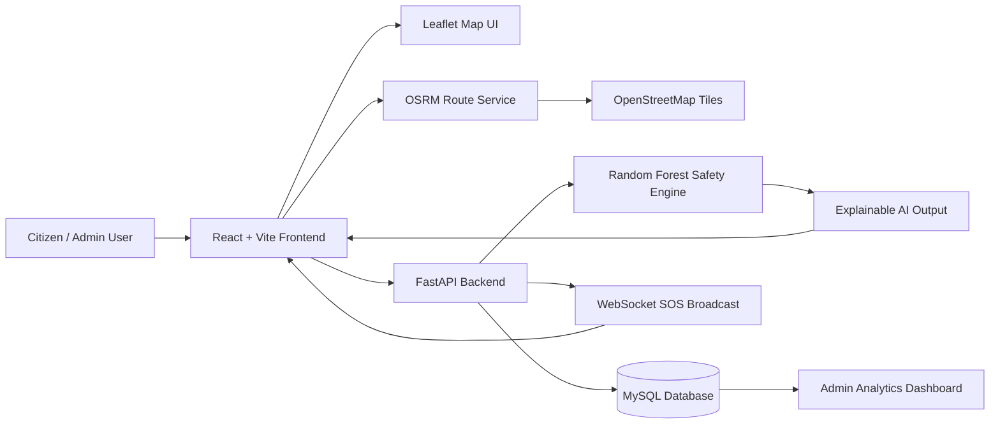

# SurakshaPath AI

<p align="center">
  
  
  
  
</p>

<p align="center">
  <strong>Surakshit Raasta, Smart Faisla</strong><br/>
  AI-powered safe route prediction, explainable navigation, live incident reporting, and real-time smart-city monitoring for Indore.
</p>

---

## Project Banner

**SurakshaPath AI** is a smart-city safety navigation platform built for the **BGI Hackathon 2026** under the theme **Smart Cities & Urban Innovation**. It combines **AI safe-route prediction**, **live navigation**, **incident reporting**, and an **admin analytics dashboard** to help citizens make safer travel decisions in real time.

> **Core promise:** turn safety data into a clear, explainable, route-by-route decision for citizens, responders, and city administrators.

---

## Problem Statement

Urban travel can be uncertain when people do not know:

- which roads are safer at a given time,
- where recent incidents are concentrated,
- whether a route has poor lighting, low CCTV coverage, or delayed police response,
- how to react when a new incident appears mid-journey.

Traditional maps optimize for distance or speed, but not for **public safety**. SurakshaPath AI closes this gap by using incident data, city risk signals, and machine learning to recommend safer routes with transparent reasoning.

---

## Solution Overview

SurakshaPath AI provides a smart navigation experience that is designed for both citizens and administrators:

- citizens search for a safe route and compare alternatives,
- the AI engine scores each route and explains why it is recommended,
- the live navigation mode monitors the journey and produces smart alerts,
- incident reports and SOS events update the safety picture in real time,
- the admin dashboard summarizes safety analytics for the city.

The entire stack is built around:

- **FastAPI + Python** for the backend,
- **React + Vite + Tailwind + Leaflet** for the frontend,
- **MySQL** as the only database,
- **Random Forest** as the ML model family,
- **OpenStreetMap + OSRM** for maps and routing.

---

## Key Features

- AI Safe Route Prediction
- Explainable AI
- Safety Heatmaps
- Dynamic Incident Reporting
- Live Navigation
- AI Alerts
- Smart Rerouting
- Admin Dashboard
- Demo Simulation

Additional platform capabilities:

- route comparison with safety reasoning,
- voice-style smart alerts,
- live progress, ETA, and reroute guidance,
- SOS WebSocket broadcast system,
- incident feed and city safety summaries.

---

## AI Capabilities

SurakshaPath AI is not a black box. It is designed to show **why** a route is considered safe or unsafe.

- Predicts a route safety score and label.
- Highlights positive and negative safety factors.
- Produces route recommendation text in natural language.
- Summarizes the dominant risk drivers for each route.
- Supports live re-evaluation when new incidents appear.

### AI Output Highlights

- Safety score
- Safety label
- Confidence estimate
- Top risk factors
- Feature importance
- Positive factors
- Negative factors
- Risk breakdown
- Route recommendation text
- AI summary

---

## Tech Stack

| Layer | Technology | Purpose |
|---|---|---|
| Backend | FastAPI + Python | REST API, WebSocket SOS, analytics, incident reporting |
| Frontend | React + Vite + Tailwind + Leaflet | Interactive map UI, navigation dashboard, responsive product shell |
| Database | MySQL | Persistent storage for incidents, SOS alerts, and safety data |
| ML | Random Forest (Scikit-learn) | Safety prediction and explainable risk scoring |
| Maps | OpenStreetMap + OSRM | Map display and route geometry generation |

### Key Libraries

- `SQLAlchemy`
- `Pydantic`
- `Pandas`
- `NumPy`
- `Recharts`
- `Framer Motion`
- `React Router`
- `React Leaflet`

---

## System Architecture



### Architecture Notes

- The frontend handles route visualization and smart navigation UX.
- The backend owns prediction, reporting, analytics, and SOS broadcast logic.
- The ML engine returns both scores and human-readable explanations.
- MySQL is the only database used in this project.
- OpenStreetMap and OSRM are used for map and route data.

---

## Folder Structure

```text
SurakshaPath AI/
├── backend/
│   ├── __init__.py
│   ├── database.py
│   ├── main.py
│   ├── models.py
│   ├── requirements.txt
│   ├── safety.py
│   └── saftey.py
├── frontend/
│   ├── index.html
│   ├── package.json
│   ├── postcss.config.js
│   ├── tailwind.config.js
│   ├── vite.config.js
│   └── src/
│       ├── App.jsx
│       ├── main.jsx
│       ├── api/
│       ├── components/
│       ├── data/
│       ├── hooks/
│       ├── pages/
│       ├── services/
│       └── styles/
├── ml_data/
├── indore_incidents.csv
├── safety_dataset_enhanced.csv
├── migrate_db.py
├── safety.py
├── test_sos_browser.html
├── test_sos_system.py
├── QUICK_START.md
└── WEBSOCKET_SOS_GUIDE.md
```

---

## Installation Guide

### Prerequisites

- Python 3.10+
- Node.js 18+
- MySQL 8+
- Git

### 1. Clone the Repository

```bash
git clone <repo-url>
cd "SurakshaPath AI"
```

### 2. Backend Setup

```bash
cd backend
pip install -r requirements.txt
uvicorn backend.main:app --reload
```

### 3. Frontend Setup

```bash
cd frontend
npm install
npm run dev
```

---

## Backend Setup

The backend is built with FastAPI and reads its MySQL configuration from `backend/.env`.

### MySQL Environment Variables

Create `backend/.env` with values like:

```env
DB_HOST=localhost
DB_PORT=3306
DB_USER=root
DB_PASSWORD=your_password
DB_NAME=surakshapath_db
```

### Backend Start Command

```bash
uvicorn backend.main:app --reload
```

### Backend Responsibilities

- safety prediction API
- incident reporting API
- admin analytics API
- SOS trigger and WebSocket broadcast
- database initialization and ORM management

---

## Frontend Setup

The frontend is a React + Vite application styled with Tailwind CSS and powered by Leaflet for maps.

### Install and Run

```bash
npm install
npm run dev
```

### Frontend Responsibilities

- route search and comparison
- map rendering and navigation overlays
- live navigation HUD
- incident reporting modal
- smart alert toasts
- admin dashboard UI

---

## Database Setup

SurakshaPath AI uses **MySQL only**.

### Create the Database

```sql
CREATE DATABASE surakshapath_db;
```

### Suggested Tables

- `users`
- `incidents`
- `sos_alerts`
- `areas`

### Notes

- The backend auto-creates ORM tables on startup.
- Existing MySQL tables may still need migration if schema fields are added later.
- Do not use SQLite for this project.

---

## Troubleshooting

Known issues that have already been fixed once — don't reintroduce them.

### 1. Backend crashes on startup with `UnicodeEncodeError`

**Symptom:** `uvicorn` starts, loads the DB and models, then dies with
`UnicodeEncodeError: 'charmap' codec can't encode character '✅'` during
`startup_event`.

**Cause:** Windows' console defaults to the `cp1252` codepage, which can't
encode emoji (`✅`, `⚠️`, etc.) used in `print()` startup logs.

**Fix (already applied):** `backend/main.py` forces UTF-8 on `stdout`/`stderr`
before anything else runs:

```python
if hasattr(sys.stdout, "reconfigure"):
    sys.stdout.reconfigure(encoding="utf-8")
if hasattr(sys.stderr, "reconfigure"):
    sys.stderr.reconfigure(encoding="utf-8")
```

Keep this at the very top of `main.py`, before any other imports that might
print. Don't "fix" this by stripping emoji from log messages instead — the
next print with an emoji will just reintroduce the crash.

### 2. `/areas/analyze-image` always saves `area_name: "Unknown"`

**Symptom:** Uploading an image with a form field `area_name` (e.g. from the
incident report modal) is ignored — the saved incident and area always show
`"Unknown"` regardless of what was submitted.

**Cause:** The endpoint declared `area_name: str = "Unknown"` without FastAPI's
`Form(...)`. On a `multipart/form-data` request, a plain (non-`File`) parameter
without `Form(...)` is read as a **query parameter**, not a form field — so the
value the frontend sent in the body was silently dropped.

**Fix (already applied):** import `Form` from `fastapi` and declare the
parameter as `area_name: str = Form("Unknown")`. Any new form field added to a
multipart endpoint alongside `UploadFile` must use `Form(...)`, or it will be
silently ignored the same way.

### 3. SOS alerts don't broadcast over the `/ws/sos` WebSocket

**Symptom:** `POST /sos/trigger` returns `200`/success and saves the alert to
`sos_alerts`, but clients connected to `ws://.../ws/sos` never receive it.

**Cause:** `backend/main.py` used to define its *own* `POST /sos/trigger` (with
the WebSocket broadcast logic) directly on `app`, but `backend/sos.py`'s router
is mounted at the same `/sos` prefix and is included *earlier* in `main.py`. In
FastAPI/Starlette, the first-registered route matching a path wins — so
`sos.py`'s handler (which saves the alert and sends WhatsApp guardian
notifications) always ran instead, and `main.py`'s duplicate broadcast code was
dead, unreachable code.

**Fix (already applied):**
- The shared `ConnectionManager` now lives in `backend/ws_manager.py`, imported
  by both `main.py` and `sos.py` (avoids a circular import between them).
- `sos.py`'s real `/trigger` handler calls `manager.broadcast(...)` after
  saving the alert.
- The dead duplicate `/sos/trigger` and `/sos/active` routes were removed from
  `main.py`.

If you ever need to add another SOS-related route, add it to `backend/sos.py`
(the router that's actually mounted), not as a second definition in
`main.py` — duplicate path operations across files fail silently, not loudly.

---

## API Endpoints

| Endpoint | Method | Purpose |
|---|---:|---|
| `/predict` | `POST` | Predict route safety score, label, and explainable AI breakdown |
| `/routes/get` | `GET` | Route-discovery flow used by the app for safe route retrieval and comparison |
| `/incidents/report` | `POST` | Submit a new incident report to the system |
| `/admin/dashboard` | `GET` | Fetch city-level dashboard analytics |
| `/ws/sos` | `WS` | Subscribe to live SOS broadcasts |

### Useful Supporting Endpoints

| Endpoint | Method | Purpose |
|---|---:|---|
| `/health` | `GET` | Backend and model health check |
| `/incidents/recent` | `GET` | Latest incidents for map and dashboard views |
| `/sos/trigger` | `POST` | Trigger an emergency SOS alert |
| `/sos/active` | `GET` | Retrieve active SOS alerts |
| `/admin/heatmap` | `GET` | Fetch heatmap summary data |
| `/test/predict` | `GET` | Quick AI prediction test |

---

## ML Model Details

- Dataset size: **50,000 rows**
- Model family: **Random Forest**
- Classification accuracy: **99.65%**
- Explainability: **supported**

### Model Inputs

The model uses route and safety signals such as:

- area type
- time of day
- lighting quality
- crime rate
- crowd density
- incident count
- CCTV coverage
- police distance
- women safety risk
- street light coverage
- police station proximity
- NCRB crime intensity
- real incident count
- women incident count
- high severity count

### Model Outputs

- `safety_score`
- `safety_label`
- `confidence`
- `top_risk_factors`
- `feature_importance`
- `positive_factors`
- `negative_factors`
- `dominant_risk`
- `risk_breakdown`
- `risk_level`
- `safest_route_reason`
- `avoid_route_reason`
- `route_recommendation_text`
- `ai_summary`

---

## Demo Flow

Use this flow to present the project to judges:

1. Open the app and let the splash screen reveal the product identity.
2. Point out the banner, tagline, and hackathon branding.
3. Enter a source and destination or use the prefilled demo route.
4. Click **Find Safe Route** to generate route options.
5. Show the route comparison panel and explain how the AI scores safety.
6. Open the live navigation mode and start the journey.
7. Trigger the **Demo Simulation** button to showcase incident injection.
8. Highlight the smart alert toast, reroute recommendation, and live timeline updates.
9. Switch to the admin dashboard to show analytics, heatmap summary, and recent incidents.
10. End by explaining how the system can support real-world safe travel and city response workflows.

### Judge Talking Points

- This is not only a map, it is a **safety decision engine**.
- The model is **explainable**, so users can trust the recommendation.
- The platform supports **real-time incident updates** and **live rerouting**.
- The admin view gives city operators a clean safety overview.

---

## Screenshots Placeholder

Add screenshots here before final submission:

| Screen | Placeholder |
|---|---|
| Home / Landing | `docs/screenshots/home.png` |
| Safe Route Comparison | `docs/screenshots/route-comparison.png` |
| Live Navigation | `docs/screenshots/live-navigation.png` |
| Smart Alerts | `docs/screenshots/smart-alerts.png` |
| Admin Dashboard | `docs/screenshots/admin-dashboard.png` |
| SOS Flow | `docs/screenshots/sos.png` |

You can also place a short screen-recording GIF or MP4 in a `docs/media/` folder for better judge presentation.

---

## Future Scope

- IoT Panic Button
- Real Police API Integration
- Real-time CCTV Analytics
- Mobile App Deployment
- Voice Assistant Expansion
- Multi-city rollout support
- Historical trend forecasting
- Disaster-response routing layer

---

## Team Details

**Project:** SurakshaPath AI

**Tagline:** Surakshit Raasta, Smart Faisla

**Hackathon:** BGI Hackathon 2026

**Theme:** Smart Cities & Urban Innovation

**Team:** Techmate

**Team ID:** 2436

---

## License

This repository currently does not include an explicit license file.

If you plan to publish or reuse this project outside the hackathon context, add a license such as MIT, Apache 2.0, or a custom team license before public distribution.

---

## Acknowledgements

- OpenStreetMap for map tiles and base geography
- OSRM for route geometry generation
- FastAPI for the backend API layer
- React and Leaflet for the interactive experience
- Scikit-learn for the Random Forest safety engine

---

## Quick Run Summary

```bash
# Backend
cd backend
pip install -r requirements.txt
uvicorn backend.main:app --reload

# Frontend
cd frontend
npm install
npm run dev
```

<p align="center">
  <strong>Surakshit Raasta, Smart Faisla</strong><br/>
  Built for safer movement, clearer decisions, and stronger smart-city operations.
</p>
