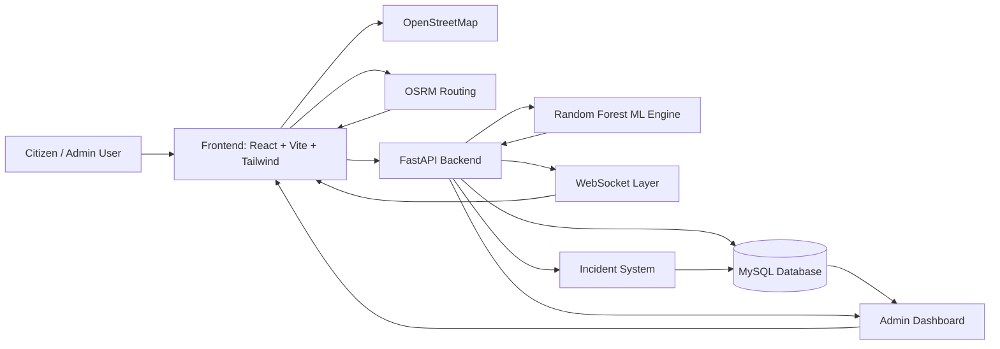

# System Architecture

**SurakshaPath AI**  
**Tagline:** Surakshit Raasta, Smart Faisla  
**Hackathon:** BGI Hackathon 2026

## Architecture Overview

SurakshaPath AI is built as a smart-city safety platform that combines route prediction, explainable AI, incident intelligence, live navigation, and admin analytics.

### Core Components

| Layer | Component | Responsibility |
|---|---|---|
| Presentation | Frontend (React + Vite + Tailwind) | User interface, map view, route comparison, live navigation, dashboard views |
| Application | Backend (FastAPI) | REST APIs, incident reporting, analytics, WebSocket broadcasts, prediction orchestration |
| Intelligence | ML Engine (Random Forest) | Safety scoring, classification, explainability signals, route recommendation logic |
| Storage | MySQL Database | Persistent storage for incidents, SOS alerts, users, and area records |
| Mapping | OpenStreetMap | Base map tiles and geographic context |
| Routing | OSRM Routing | Route geometry, path coordinates, and travel-time calculations |
| Realtime | WebSocket Layer | Live SOS and incident broadcasts |
| Operations | Admin Dashboard | Monitoring, analytics, heatmap summaries, and recent reports |
| Safety | Incident System | Dynamic reporting, moderation, and safety signal updates |

## Data Flow

## Request Lifecycle

1. The user enters a source and destination in the frontend.
2. The frontend requests safe route data and route geometry.
3. The backend passes safety attributes to the Random Forest engine.
4. The ML engine returns a score, label, risk breakdown, and explainable factors.
5. The frontend renders route cards, map overlays, and comparison views.
6. During live navigation, the WebSocket layer streams SOS and incident updates.
7. The admin dashboard reads aggregated incident and heatmap data from MySQL.

## Design Principles

- MySQL is the only database used in the project.
- OpenStreetMap is the only map provider used in the project.
- Random Forest is the only model family used in the project.
- The system favors explainable output over opaque scoring.
- The UI is designed for live demo clarity and judge presentation.
